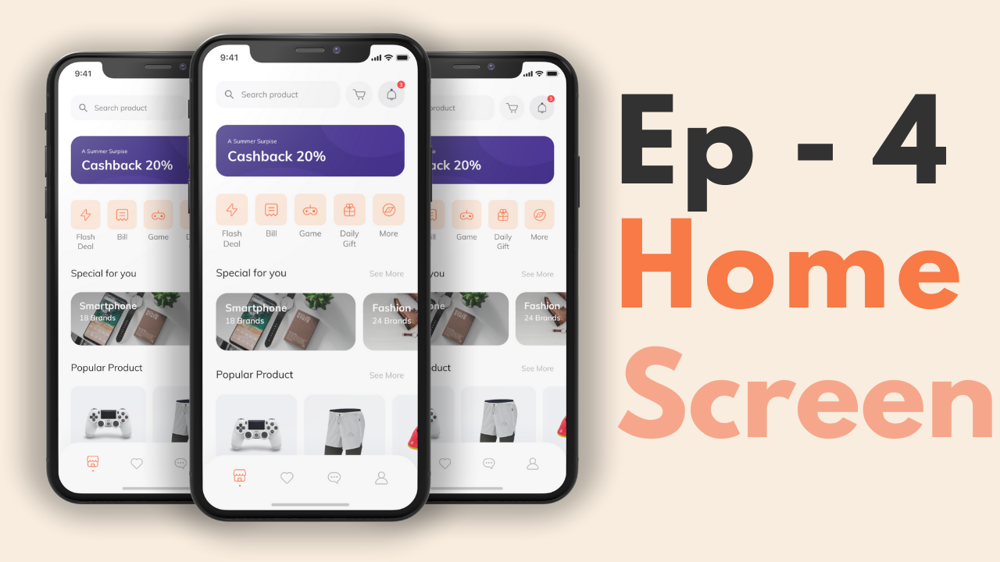

# Flutter Chat App Prototype

### Checkout [Serverpod.dev](https://cutt.ly/Per1Z7ri) - The Flutter Backend

This project is evolving from an e-commerce example into a basic chat application inspired by WhatsApp or Signal. It now features a dark theme with blue accents and provides a minimal chat list and conversation view.

### Video Preview of the Shop template

## Screens it contains:

This build uses a dark theme with blue accent colors.

Screens currently available:

=> Onboarding

=> Login

=> Forgot Password

=> Sign Up (disabled)

=> Complete Profile

=> OTP Verification

=> Chats List

=> Conversation View

=> Profile

=> Bottom Navigation Bar

Work is ongoing to expand the messaging features.

## Photos

